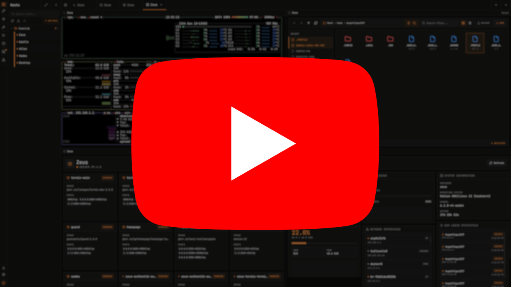

<div align="center">


<h1>Termix</h1>

<p>Selbst gehostete SSH-Verwaltung</p>

<p>
  <a href="../README.md">English</a> ·
  <a href="README-CN.md">中文</a> ·
  <a href="README-JA.md">日本語</a> ·
  <a href="README-KO.md">한국어</a> ·
  <a href="README-FR.md">Français</a> ·
  Deutsch ·
  <a href="README-ES.md">Español</a> ·
  <a href="README-PT.md">Português</a> ·
  <a href="README-RU.md">Русский</a> ·
  <a href="README-AR.md">العربية</a> ·
  <a href="README-HI.md">हिन्दी</a> ·
  <a href="README-TR.md">Türkçe</a> ·
  <a href="README-VI.md">Tiếng Việt</a> ·
  <a href="README-IT.md">Italiano</a>
</p>

<p>
  
  
  
  <a href="https://discord.gg/jVQGdvHDrf"></a>
  <a href="https://donate.termix.site/"></a>
</p>

<p>
  <a href="https://donate.termix.site/"></a>
</p>

<br />

Termix ist kostenlos und Open Source. Wenn Sie es nützlich finden, erwägen Sie eine [Spende](https://donate.termix.site/), um Serverkosten und Entwicklungszeit zu decken.

<br />


<br />
<br />

<p>
  
  <br />
  <sub>Erreicht am 1. September 2025</sub>
</p>

</div>

<br />

## Uberblick

Termix ist eine quelloffene, dauerhaft kostenlose, selbst gehostete All-in-One-Serververwaltungsplattform. Sie bietet eine plattformubergreifende Losung zur Verwaltung Ihrer Server und Infrastruktur uber eine einzige, intuitive Oberflache. Termix bietet SSH-Terminalzugriff, SSH-Tunneling-Funktionen, Remote-Dateiverwaltung und viele weitere Werkzeuge. Termix ist die perfekte kostenlose und selbst gehostete Alternative zu Termius, verfugbar fur alle Plattformen.

<br />

## Funktionen

<table>
<tr>
<td width="50%" valign="top">

**SSH-Terminalzugriff:**
Voll ausgestattetes Terminal mit Split-Screen-Unterstutzung (bis zu 4 Panels) mit einem browserahnlichen Tab-System. Enthalt Unterstutzung fur die Anpassung des Terminals einschliesslich gangiger Terminal-Themes, Schriftarten und anderer Komponenten.

</td>
</tr>
<tr>
<td width="50%" valign="top">

**SSH-Tunnelverwaltung:**
Erstellen und verwalten Sie Server-zu-Server-SSH-Tunnel mit automatischer Wiederverbindung, Gesundheitsuberwachung sowie lokaler, entfernter oder dynamischer SOCKS-Weiterleitung. Desktop-Client-zu-Server-Tunneleinstellungen werden lokal pro Desktop-Installation gespeichert, optionale C2S-Preset-Snapshots konnen auf dem Server gespeichert, umbenannt, geladen oder geloscht werden, wenn Sie eine lokale Tunnelkonfiguration zwischen Clients ubertragen mochten.

</td>
<td width="50%" valign="top">

**Remote-Dateimanager:**
Verwalten Sie Dateien direkt auf Remote-Servern mit Unterstutzung fur das Anzeigen und Bearbeiten von Code, Bildern, Audio und Video. Laden Sie Dateien hoch, herunter, benennen Sie sie um, loschen oder verschieben Sie sie nahtlos mit Sudo-Unterstutzung. Enthalt Unterstutzung fur das Verschieben von Dateien von Server zu Server.

</td>
</tr>
<tr>
<td width="50%" valign="top">

**Docker- und Podman-Verwaltung:**
Container starten, stoppen, pausieren, entfernen. Container-Statistiken anzeigen. Container uber Docker-Exec-Terminal steuern. Unterstutzt sowohl Docker als auch Podman als Container-Laufzeitumgebung. Es wurde nicht entwickelt, um Portainer oder Dockge zu ersetzen, sondern um Ihre Container einfach zu verwalten, anstatt sie zu erstellen.

</td>
<td width="50%" valign="top">

**SSH-Host-Manager:**
Speichern, organisieren und verwalten Sie Ihre SSH-Verbindungen mit Tags und Ordnern (Ordneranpassung und verschachtelte Ordner werden unterstutzt) und speichern Sie einfach wiederverwendbare Anmeldeinformationen mit der Moglichkeit, die Bereitstellung von SSH-Schlusseln zu automatisieren.

</td>
</tr>
<tr>
<td width="50%" valign="top">

**Host-Metriken:**
CPU-, Arbeitsspeicher- und Festplattenauslastung, Netzwerk, Betriebszeit, Systeminformationen, Firewall, Port-Monitor, Log-Viewer, Benutzer/Berechtigungen, Zertifikate und vieles mehr anzeigen, was auf den meisten Linux-basierten Servern funktioniert. Enthalt Zeitreihen-Verlaufsdiagramme und schwellenwertbasierte Warnmeldungen mit ntfy- und Webhook-Unterstutzung.

</td>
<td width="50%" valign="top">

**Benutzerauthentifizierung:**
Sichere Benutzerverwaltung mit Admin-Kontrollen (kann Informationen anderer Benutzer bearbeiten) und OIDC-/LDAP-/SSO-Unterstutzung (mit Zugriffskontrolle), 2FA (TOTP) und Passkey (WebAuthn)-Unterstutzung. Aktive Benutzersitzungen uber alle Plattformen anzeigen und Berechtigungen widerrufen. OIDC-/Lokale Konten miteinander verknupfen. Audit-Protokoll aller Benutzeraktionen anzeigen.

</td>
</tr>
<tr>
<td width="50%" valign="top">

**Tailscale-Integration:**
Gerate aus Ihrem Tailnet auflisten, um sie schnell als Hosts hinzuzufugen, und mit Tailscale SSH als Authentifizierungsmethode verbinden, sodass Ihre Tailnet-ACLs die Autorisierung ubernehmen, ohne Anmeldedaten speichern zu mussen.

</td>
<td width="50%" valign="top">

**RBAC/Freigabe:**
Erstellen Sie Rollen und teilen Sie Hosts uber Benutzer/Rollen hinweg. Unterstutzt alle Authentifizierungstypen und alle Host-Protokolle.

</td>
</tr>
<tr>
<td width="50%" valign="top">

**Serielle Verbindungen:**
Verbinden Sie sich direkt vom Browser oder der Desktop-App aus mit seriellen Geraten (Router, Switches, Mikrocontroller usw.). Konfigurieren Sie Baudrate, Datenbits, Stoppbits und Paritat. Verwendet die Web Serial API in unterstutzten Browsern oder ein natives Backend in der Electron-App.

</td>
<td width="50%" valign="top">

**Warnmeldungen:**
Legen Sie schwellenwertbasierte Warnregeln fur Host-Metriken (CPU, Arbeitsspeicher, Festplatte usw.) fest und erhalten Sie Benachrichtigungen uber ntfy oder Webhooks, wenn diese ausgelost werden. Zeigen Sie ausgeloste und aufgeloste Warnmeldungen in einem Verlaufsprotokoll an.

</td>
</tr>
<tr>
<td width="50%" valign="top">

**Startseite:**
Eine vollstandig anpassbare Startseite mit einem Drag-and-Drop-Widget-Raster. Fugen Sie Widgets fur Hoststatus, Service-Links, Uhren, Notizen, RSS-Feeds, Wetter, Docker-Container, Host-Metrik-Diagramme, eingebettete Terminals, iFrames und mehr hinzu.

</td>
<td width="50%" valign="top">

**Datenbankverschlusselung:**
Backend gespeichert als verschlusselte SQLite-Datenbankdateien. Weitere Informationen in der [Dokumentation](https://docs.termix.site/security).

</td>
</tr>
<tr>
<td width="50%" valign="top">

**Netzwerkgraph:**
Passen Sie Ihr Dashboard an, um Ihr Homelab basierend auf Ihren SSH-Verbindungen mit Statusunterstutzung zu visualisieren.

</td>
<td width="50%" valign="top">

**SSH-Werkzeuge:**
Erstellen Sie wiederverwendbare Befehlsvorlagen, die mit einem einzigen Klick ausgefuhrt werden. Fuhren Sie einen Befehl gleichzeitig in mehreren geoffneten Terminals aus.

</td>
</tr>
<tr>
<td width="50%" valign="top">

**Persistente Tabs:**
SSH-Sitzungen und Tabs bleiben uber Gerate/Aktualisierungen hinweg offen, wenn im Benutzerprofil aktiviert.

</td>
<td width="50%" valign="top">

**Sprachen:**
Integrierte Unterstutzung fur ca. 30 Sprachen (verwaltet uber [Crowdin](https://docs.termix.site/translations)).

</td>
</tr>
</table>

<br />

<details>
<summary><b>Weitere Funktionen</b></summary>
<br />

- **Dashboard** - Serverinformationen auf einen Blick auf Ihrem Dashboard anzeigen
- **API-Schlussel** - Erstellen Sie benutzerbezogene API-Schlussel mit Ablaufdaten zur Verwendung fur Automatisierung/CI
- **Datenexport/-import** - SSH-Hosts, Anmeldeinformationen und Dateimanager-Daten exportieren und importieren
- **Automatische SSL-Einrichtung** - Integrierte SSL-Zertifikatsgenerierung und -verwaltung mit HTTPS-Weiterleitungen
- **Moderne Benutzeroberflache** - Saubere desktop-/mobilfreundliche Oberflache, erstellt mit React, Tailwind CSS und Shadcn. Wahlen Sie zwischen vielen verschiedenen UI-Themes einschliesslich Hell, Dunkel, Dracula usw. Verwenden Sie URL-Routen, um jede Verbindung im Vollbildmodus zu offnen.
- **Befehlsverlauf** - Autovervollstandigung und Anzeige zuvor ausgefuhrter SSH-Befehle
- **Schnellverbindung** - Verbinden Sie sich mit einem Server, ohne die Verbindungsdaten speichern zu mussen
- **Befehlspalette** - Doppeltippen Sie die linke Umschalttaste, um schnell auf SSH-Verbindungen mit Ihrer Tastatur zuzugreifen
- **Proxmox-Integration** - Automatisches Hinzufugen von Hosts zu Termix aus Ihrer Proxmox-Instanz
- **SSH-Funktionsreich** - Unterstutzt Jump-Hosts, Warpgate, TOTP-basierte Verbindungen, SOCKS5, Host-Key-Verifizierung, automatisches Ausfullen von Passwortern, [OPKSSH](https://github.com/openpubkey/opkssh), tmux, Port Knocking, Terminal-Protokollierung, SSH-Agent-Forwarding, Bitwarden SSH-Agent, HashiCorp Vault SSH-Signierung und mehr.
- **Termix ID** - Ein sshid.io-Aquivalent, integriert in Termix. Beanspruchen Sie einen Handle, veroffentlichen Sie Ihre offentlichen SSH-Schlussel unter einer Resolver-URL und nutzen Sie eine integrierte CA zur Ausstellung von SSH-Zertifikaten.

</details>

<br />

## Plattformunterstutzung

<table align="center">
<tr>
<th align="center">Plattform</th>
<th align="center">Distribution</th>
</tr>
<tr>
<td align="center"><b>Web</b></td>
<td>Jeder moderne Browser (Chrome, Safari, Firefox) · PWA-Unterstutzung</td>
</tr>
<tr>
<td align="center"><b>Windows</b> <sub>x64/ia32</sub></td>
<td>Portabel · MSI-Installationsprogramm · Chocolatey</td>
</tr>
<tr>
<td align="center"><b>Linux</b> <sub>x64/ia32</sub></td>
<td>Portabel · AUR · AppImage · Deb · Flatpak</td>
</tr>
<tr>
<td align="center"><b>macOS</b> <sub>x64/ia32, v12.0+</sub></td>
<td>Apple App Store · DMG · Homebrew</td>
</tr>
<tr>
<td align="center"><b>iOS/iPadOS</b> <sub>v15.1+</sub></td>
<td>Apple App Store · IPA</td>
</tr>
<tr>
<td align="center"><b>Android</b> <sub>v7.0+</sub></td>
<td>Google Play Store · APK</td>
</tr>
</table>

<br />

## Installation

Besuchen Sie die [Termix-Dokumentation](https://docs.termix.site/install) fur vollstandige Installationsanleitungen fur alle Plattformen.

Beispiel einer Docker-Compose-Datei:

```yaml
services:
  termix:
    image: ghcr.io/lukegus/termix:latest
    container_name: termix
    restart: unless-stopped
    ports:
      - "8080:8080"
    volumes:
      - termix-data:/app/data
    environment:
      PORT: "8080"

volumes:
  termix-data:
    driver: local
```

<br />

## Spenden

Termix ist kostenlos und Open Source, ohne Abonnements oder kostenpflichtige Plane. Wenn Sie es nutzlich finden, erwagen Sie eine Spende, um Serverkosten, Domains und Entwicklungszeit zu decken. Spenden helfen auch dabei, die Zeit zu finanzieren, die benotigt wird, um zu erforschen und zu lernen, was fur Funktionen wie SAML-, Kubernetes- und Agent-Unterstutzung erforderlich ist. Verfolgen Sie den Fortschritt und spenden Sie unten.

[Spenden](https://donate.termix.site/)

<br />

## Sponsoren

Interessiert an einer bezahlten Platzierung zur Unterstutzung der Entwicklung? Schreiben Sie eine E-Mail an [mail@termix.site](mailto:mail@termix.site).

<div align="center">

<br />

<a href="https://www.digitalocean.com/">
  
</a>
&nbsp;&nbsp;&nbsp;
<a href="https://crowdin.com/">
  
</a>
&nbsp;&nbsp;&nbsp;
<a href="https://www.blacksmith.sh/">
  
</a>
&nbsp;&nbsp;&nbsp;
<a href="https://www.cloudflare.com/">
  
</a>
&nbsp;&nbsp;&nbsp;
<a href="https://tailscale.com/">
  
</a>
&nbsp;&nbsp;&nbsp;
<a href="https://akamai.com/">
  
</a>
&nbsp;&nbsp;&nbsp;
<a href="https://aws.amazon.com/">
  
</a>
&nbsp;&nbsp;&nbsp;
<a href="https://rackgenius.com/">
  
</a>

</div>

<br />

## Support

Wenn Sie Hilfe benotigen oder eine Funktion fur Termix anfragen mochten, besuchen Sie die [Issues](https://github.com/Termix-SSH/Support/issues)-Seite, melden Sie sich an und klicken Sie auf `New Issue`. Bitte beschreiben Sie Ihr Anliegen so detailliert wie moglich, vorzugsweise auf Englisch. Sie konnen auch dem [Discord](https://discord.gg/jVQGdvHDrf)-Server beitreten und den Support-Kanal besuchen, allerdings konnen die Antwortzeiten dort langer sein.

<br />

## Screenshots

<div align="center">

<br />

[](https://www.youtube.com/@TermixSSH/videos)

<sub>Update-Ubersichten auf YouTube ansehen</sub>

<br />
<br />

<table>
<tr>
<td></td>
<td></td>
</tr>
<tr>
<td></td>
<td></td>
</tr>
<tr>
<td></td>
<td></td>
</tr>
<tr>
<td></td>
<td></td>
</tr>
<tr>
<td></td>
<td></td>
</tr>
<tr>
<td></td>
<td></td>
</tr>
<tr>
<td></td>
<td></td>
</tr>
<tr>
<td></td>
<td></td>
</tr>
</table>

<sub>Einige Videos und Bilder konnen veraltet sein oder Funktionen moglicherweise nicht perfekt darstellen.</sub>

</div>

<br />

## Geplante Funktionen

Siehe [Projekte](https://github.com/orgs/Termix-SSH/projects/5) fur alle geplanten Funktionen. Wenn Sie beitragen mochten, siehe [Mitwirken](https://github.com/Termix-SSH/Termix/blob/main/CONTRIBUTING.md).

<br />

## Lizenz

Verteilt unter der Apache License Version 2.0. Siehe `LICENSE` fur weitere Informationen.
